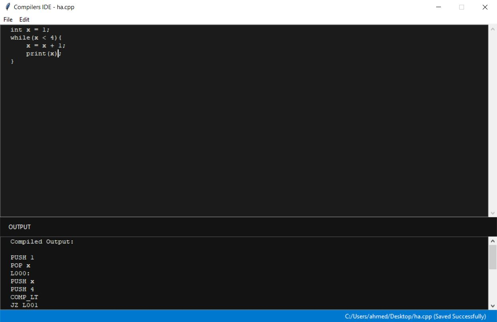

# Compilers-Project

This is a simple, strongly typed programming language. It has lots of similarities with the C language but with fewer features. It compiles the syntax to a machine language code.

The language compiler & interpreter provide a clear and helpful error handler that will help you catch errors and solve them easily.
The project uses Flex to generate the lexical analyzer and Bison to generate the parser for our language.

## Syntax

### Variables declaration.

```
int x = 5 + 1;
float z = 1.5;
bool isActive = true;
string name = "compiler";
```

### Constants declaration

```
const float x = 3.1415;
```

### Mathematical expressions

```
int x = 1;
print(x + 1);
print(-x * 5);
print(-x * 2 + 5 + (-1*x));
```

### Logical expressions

```
int x = 1;
int y = 3;
print( x < 1 );
print( x < y );
print( x == y );
print( not ( x == y));
print( (1 > 2) and ( 1 > 0));
print( (1 > 2) or ( 1 > 0));
```

### Assignment statement

```
int x = 10;
x = 5 + 2;
x = x + 1;
```

### If-else statement

```
int x = 1;
if(x < 1)
    x = x + 1;
else {
    x = x + 2;
    print(x);
}
```

### While loops

```
int x = 1;
while(x < 4){
    x = x + 1;
    print(x);
}
```

### Do-while loops

```
int x = 1;
do{
    x = x + 1;
    print(x);
} while (x < 1)
```

### for loops

```
for(int y = 1; y < 4; y = y + 1){
    print (y);
    y = y + 1;
}

int x = 1;
for(; x < 4; x = x +1)
    print (x);
```

### switch statement

```
int x = 1;
switch(x){
    case x + 1:
        print(x);
    case x: {
        x = x + 1;
        print(x);
    }
}
```

### Functions

#### Declaration

```
int add(int x, int y){
    return x + y;
}

print(add(1, 2));
```

#### Default argument

```
int add(int x, int y, int z = 0){
    int result = x + y + z;
    print(result);
    return result;
}

add(1, 4);
```

### Comments

```
// Hello!
int x = 1;

/* Multiline
   comments
   are
   supported!
*/
print(x);
```

## Gui

The Gui can run or compile the code. It also shows any semantic or syntax errors.



## Quadruples

A list of the language generated quadruples and their description.
| Quadruple | Description |
| ------------- | ------------- |
| PUSH | Push variable or value to the stack |
| POP | Pop the last element in the stack to a variable |
| JMP | Unconditional jump to a label |
| JZ | Jump to label if the last element in the stack is zero |
| CALL | Call procedure |
| PROC | Declare a new procedure |
| RET | Push the result of a procedure to the stack and stop it’s execution |

### Binary operators

These operators work on last two elements in the stack - ARG1, ARG2 - and saves the result on the top of the stack

| Quadruple | Description    |
| --------- | -------------- |
| ADD       | ARG1 + ARG2    |
| SUB       | ARG1 - ARG2    |
| MUL       | ARG1 \* ARG2   |
| DIV       | ARG1 / ARG2    |
| COMP_LT   | ARG1 < ARG2    |
| COMP_GT   | ARG1 > ARG2    |
| COMP_LE   | ARG1 <= ARG2   |
| COMP_GE   | ARG1 >= ARG2   |
| COMP_NE   | ARG1 != ARG2   |
| COMP_EQ   | ARG1 == ARG2   |
| AND       | ARG1 && ARG2   |
| OR        | ARG1 \|\| ARG2 |

### Unary operators

These operators work on last element in the stack - ARG - and saves the result on the top of the stack

| Quadruple | Description |
| --------- | ----------- |
| NOT       | !ARG        |
| NEG       | -1 \* ARG   |
